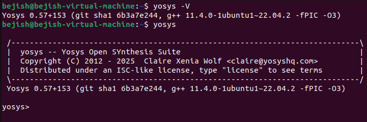
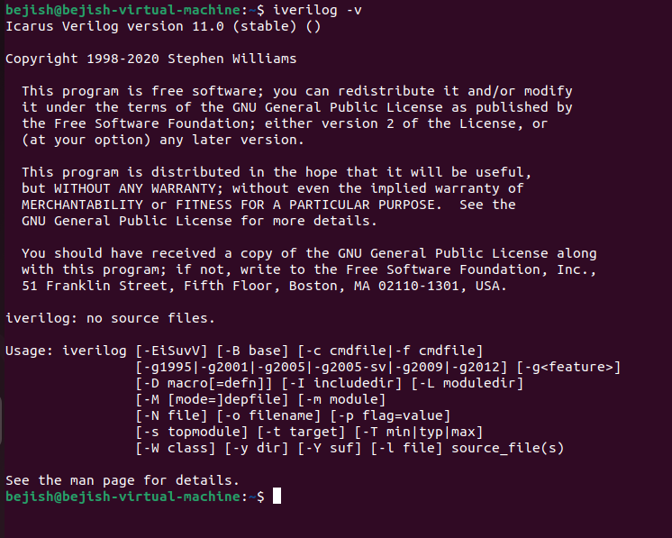
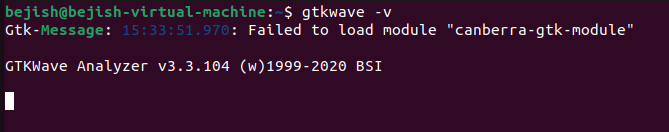
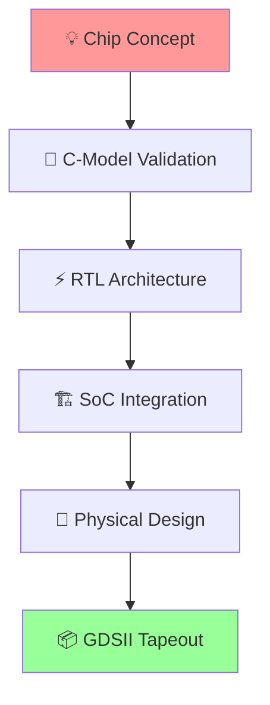

<div align="center">

# 🚀 RISC-V SoC Tapeout Journey
### *From Silicon Dreams to Digital Reality*

[](https://riscv.org/)
[](https://vsdiat.com)
[](#)
[](#)

---

*"Every great chip starts with a single line of code"*

</div>

## 🌟 Mission Control Dashboard

> **Objective**: Master the complete SoC design flow from concept to silicon  
> **Timeline**: Week 0 - Foundation Building  
> **Tools**: Industry-standard EDA toolkit  

### 🎯 **Quick Stats**
| Metric | Requirement |
|--------|-------------|
| 💾 **Memory** | 6 GB RAM |
| 💿 **Storage** | 50 GB HDD |
| 🐧 **Platform** | Ubuntu 22.04 |
| ⚡ **Power** | 4 vCPU cores |

---

## ⚙️ **EDA Arsenal Setup**

### 🔧 **Environment Optimization**
*Getting your workspace silicon-ready*

```bash
# 🎨 Display Enhancement Suite
sudo apt update && sudo apt install build-essential dkms linux-headers-$(uname -r)
cd /media/spatha/VBox_GAs_7.1.8/ && ./autorun.sh
```

### 🏗️ **Tool Installation Matrix**

#### **🎯 Yosys - The Synthesis Maestro**
*Transforming RTL dreams into gate-level reality*

<details>
<summary>📦 Click to expand installation commands</summary>

```bash
sudo apt-get update
git clone https://github.com/YosysHQ/yosys.git && cd yosys
sudo apt install make

# 🔨 Dependencies Arsenal
sudo apt-get install build-essential clang bison flex \
    libreadline-dev gawk tcl-dev libffi-dev git \
    graphviz xdot pkg-config python3 libboost-system-dev \
    libboost-python-dev libboost-filesystem-dev zlib1g-dev

make config-gcc
git submodule update --init --recursive
make && sudo make install
```
</details>

📸 **Installation Success:**


#### **⚡ Iverilog - The Simulation Engine**
*Bringing your designs to life*

```bash
sudo apt-get update && sudo apt-get install iverilog
```
📸 **Status Check:**


#### **📊 GTKWave - The Waveform Wizard**
*Visualizing the heartbeat of your design*

```bash
sudo apt-get update && sudo apt install gtkwave
```
📸 **Ready to Analyze:**


---

## 🏛️ **The SoC Design Odyssey**

### 📋 **Mission Briefing: Task 1**
*Decoding the sacred scrolls of SoC design flow*

<div align="center">



</div>

#### **Phase 1: 🧬 Chip DNA Modeling**
> *Where ideas take their first digital breath*

- **🎯 Mission**: Define the chip's genetic code
- **🔬 Method**: C-model development & testbench creation
- **✅ Success Criteria**: Specification validation complete

#### **Phase 2: ⚡ RTL Genesis**
> *Breathing life into hardware abstractions*

- **🎯 Mission**: Architect the digital soul
- **🔧 Weapons**: Verilog RTL coding mastery
- **🏗️ Components**:
  - 🧠 Processor Core
  - 🔌 Peripheral Ecosystem
  - 🎭 Analog IP Integration

#### **Phase 3: 🌐 SoC Unification**
> *When individual warriors become an army*

- **🎯 Mission**: Forge the ultimate silicon alliance
- **🔗 Process**: 
  - Component integration matrix
  - GPIO battlefield deployment
  - Physical design orchestration
  - Hard macro reinforcement

### 🏁 **The Final Countdown: Physical Realization**

<div align="center">

| Stage | Process | Outcome |
|-------|---------|---------|
| 🏗️ | **Floorplanning** | Silicon real estate allocation |
| 📍 | **Placement** | Component positioning strategy |
| 🌐 | **Routing** | Digital highway construction |
| ⏰ | **Timing Closure** | Performance optimization |
| ✅ | **DRC/LVS** | Quality assurance protocols |

</div>

---

## 🎯 **Victory Condition**
🚀 **Week 0 Mission Accomplished** - Toolkit ready for SoC journey!
[](#)
<div align="center">

---

<div align="center">

### 🚀 **Status: Mission In Progress**
*"The journey of a thousand gates begins with a single HDL line"*

[](https://riscv.org/)

**🎖️ Part of VSD RISC-V Reference SoC Tapeout Program**

</div>
